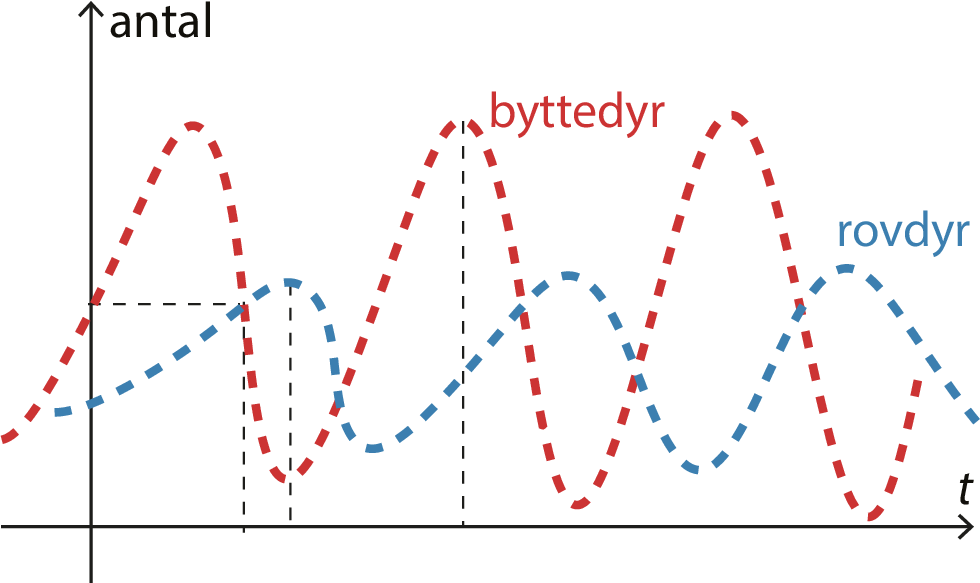

# prey_and_pred

I en prey og predator simulation vil man gerne have er resultat af 2 grafer der afbilleder Lotka-Volterra-ligningerne. Dette er fordi at graferne afbilleder to systemer, der indvirker på hinanden i et indbyrdes konkurrenceforhold, som i vores kontekst er konkurrencen mellem rovdyr og byttedyr i en afgrænset biologisk kontekst.
- Lotka-Volterra ligninger bliver defineret således:

    $\frac{dx}{dt} = kx-axy$

    $\frac{dy}{dt} = bxy - hy$

Ligning 1 svarer til antallet af byttedyr x til tiden t. Første led kx udtrukker den eksponentielle vækst af byttedyrene, som er sammensat af individernes fødsel og død. Det andet led -axy er udtryk for rovdyrenes drab på byttedyrene, der antages at være proportional med antal byttedyr gange antal rovdyr.

Ligning 2 tilsvarende til antal rovdyr y til tiden t . Det første led bxy er udtryk for tilvæksten af rovdyr, idet rovdyrene spiser byttedyrene. Det sidste led -hy er udtryk for rovdyrenes øvrige vækst og død afhængig af andre forhold.

## Tilføjelser
I min "Predator and Prey" simulation har jeg løst de krævende opgaver (som kan læses under), og jeg tilføjet følgende:

- Variable: hunger

Er løst i filerne: [prey.py](https://github.com/Zuluewe/prey_and_pred/blob/main/prey.py) og [predator.py](https://github.com/Zuluewe/prey_and_pred/blob/main/predator.py)

Dette variable er for at sikre at ulve og får ikke spiser konstant så deres energi stiger eksponentielt.
 
- Interact til prey

Er løst i filerne: [prey.py]([https://example.com](https://github.com/Zuluewe/prey_and_pred/blob/main/prey.py))

Jeg defineret interact funktionen for prey så de kan få energi og reproduce.

## Opgaver
### Opgave 1 
Er løst i filerne: [prey.py](https://github.com/Zuluewe/prey_and_pred/blob/main/prey.py) og [predator.py](https://github.com/Zuluewe/prey_and_pred/blob/main/predator.py)
- Regler ✓
    - ~~Prey/Predator skal flytte sig i et random 4-nabolag(op/ned/venstre/højre)~~
    - ~~Prey/Predator mister energi hver tur self.energy -= 1~~
    - ~~self.die() hvis energy <= 0~~
      
- Implementér: ✓
    - ~~Prey.move()~~
    - ~~Predator.move()~~

- Test ✓
    - ~~print af antal prey/predator pr.step~~

### Opgave 2
Er løst i filerne: [predator.py](https://github.com/Zuluewe/prey_and_pred/blob/main/predator.py)
- Regler: ✓
    - ~~Predator skal kunne spise én prey hvis der står en prey på samme celler.~~
    - ~~Når prey spises:~~
        - ~~prey dør (prey.die())~~
        - ~~predator får energi (fx +10)~~
          
- Implementér: ✓
    - ~~Predator.interact()~~
        - ~~finde prey på samme celle (`model.agent_at()`)~~
        - ~~prey.die() hvis er blevet spist~~

### Opgave 3
Er løst i filerne: [prey.py](https://github.com/Zuluewe/prey_and_pred/blob/main/prey.py) og [predator.py](https://github.com/Zuluewe/prey_and_pred/blob/main/predator.py)
- Regler ✓
    - ~~Hvis prey/predator har høj energi, eller efter en reproduce_rate, laver den en ny baby.~~
    - ~~Baby spawn'er ved samme position (eller nabo, hvis i vil)~~
    - ~~Forælderen mister energi (fx halverer sin energi)~~
      
- Implementér ✓
    - ~~Prey.reproduce()~~
    - ~~Predator.reproduce()~~

### Opgave 4
Er løst i filerne: [test.py](https://github.com/Zuluewe/prey_and_pred/blob/main/test.py)
- Test ✓
   - ~~Sikre at `position` altid ligger indenfor Toroidal world.~~
   - ~~Test at døde agents fjernes korrekt.~~
   - ~~Test interaktion mellem agents (predator spiser prey).~~

### Opgave 5 
Er løst i filerne: [run.py](https://github.com/Zuluewe/prey_and_pred/blob/main/run.py)
- Datasamling ✓
    - ~~Gem data over tid~~
    - ~~antal prey og predator efter hver step~~
    - ~~Plot populationer over tid~~ 

- Animation med matplotlib ✓
  - ~~animer population over tid~~ 
  - (optional) Animer 2D-verdenen. 
