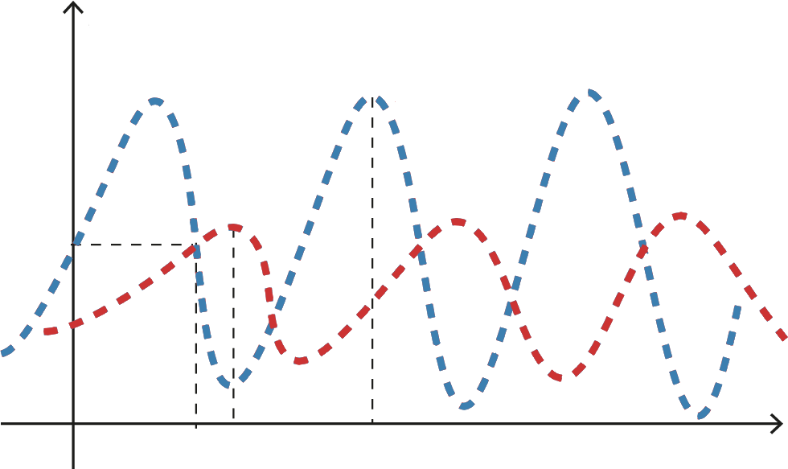

# prey_and_pred

In a prey and predator simulation, you want to obtain the result of two graphs that depict the Lotka-Volterra equations. This is because the graphs depict two systems that influence each other in a competitive relationship, which in our context is the competition between predators and prey in a defined biological context.
- Lotka-Volterra equations are defined as follows:

    $\frac{dx}{dt} = kx-axy$

    $\frac{dy}{dt} = bxy - hy$

Equation 1 corresponds to the number of prey animals x at time t. The first term kx expresses the exponential growth of prey animals, which is composed of the birth and death of individuals. The second term, -axy, represents the predators' killing of prey, which is assumed to be proportional to the number of prey times the number of predators.

Equation 2 corresponds to the number of predators y at time t. The first term bxy represents the growth of predators as they consume prey animals. The last term -hy represents the other growth and death of predators depending on other conditions.

## Additions
In my “Predator and Prey” simulation, I have solved the required tasks (which can be read below), and I have added the following:

- Variable: hunger

Solved in the file: [prey.py](https://github.com/Zuluewe/prey_and_pred/blob/main/prey.py) and [predator.py](https://github.com/Zuluewe/prey_and_pred/blob/main/predator.py)

This variable is to insure that the wolved and sheep dont eat constantly so their energy grows exponentially.

 
- Interact for prey

Solved in the file:  [prey.py]([https://example.com](https://github.com/Zuluewe/prey_and_pred/blob/main/prey.py))

I define the interact funktionen for prey so they can increase their energi og reproduce.

## Taks
### Task 1 
Solved in the file: [prey.py](https://github.com/Zuluewe/prey_and_pred/blob/main/prey.py) and [predator.py](https://github.com/Zuluewe/prey_and_pred/blob/main/predator.py)
- Regler ✓
    - ~~Prey/Predator skal flytte sig i et random 4-nabolag(op/ned/venstre/højre)~~
    - ~~Prey/Predator mister energi hver tur self.energy -= 1~~
    - ~~self.die() hvis energy <= 0~~
      
- Implementér: ✓
    - ~~Prey.move()~~
    - ~~Predator.move()~~

- Test ✓
    - ~~print af antal prey/predator pr.step~~

### task 2
Solved in the file: [predator.py](https://github.com/Zuluewe/prey_and_pred/blob/main/predator.py)
- Regler: ✓
    - ~~Predator skal kunne spise én prey hvis der står en prey på samme celler.~~
    - ~~Når prey spises:~~
        - ~~prey dør (prey.die())~~
        - ~~predator får energi (fx +10)~~
          
- Implementér: ✓
    - ~~Predator.interact()~~
        - ~~finde prey på samme celle (`model.agent_at()`)~~
        - ~~prey.die() hvis er blevet spist~~

### Task 3
Solved in the file: [prey.py](https://github.com/Zuluewe/prey_and_pred/blob/main/prey.py) og [predator.py](https://github.com/Zuluewe/prey_and_pred/blob/main/predator.py)
- Regler ✓
    - ~~Hvis prey/predator har høj energi, eller efter en reproduce_rate, laver den en ny baby.~~
    - ~~Baby spawn'er ved samme position (eller nabo, hvis i vil)~~
    - ~~Forælderen mister energi (fx halverer sin energi)~~
      
- Implementér ✓
    - ~~Prey.reproduce()~~
    - ~~Predator.reproduce()~~

### Task 4
Solved in the file: [test.py](https://github.com/Zuluewe/prey_and_pred/blob/main/test.py)
- Test ✓
   - ~~Sikre at `position` altid ligger indenfor Toroidal world.~~
   - ~~Test at døde agents fjernes korrekt.~~
   - ~~Test interaktion mellem agents (predator spiser prey).~~

### Task 5 
Solved in the file: [run.py](https://github.com/Zuluewe/prey_and_pred/blob/main/run.py)
- Datasamling ✓
    - ~~Gem data over tid~~
    - ~~antal prey og predator efter hver step~~
    - ~~Plot populationer over tid~~ 

- Animation med matplotlib ✓
  - ~~animer population over tid~~ 
  - (optional) Animer 2D-verdenen. 
